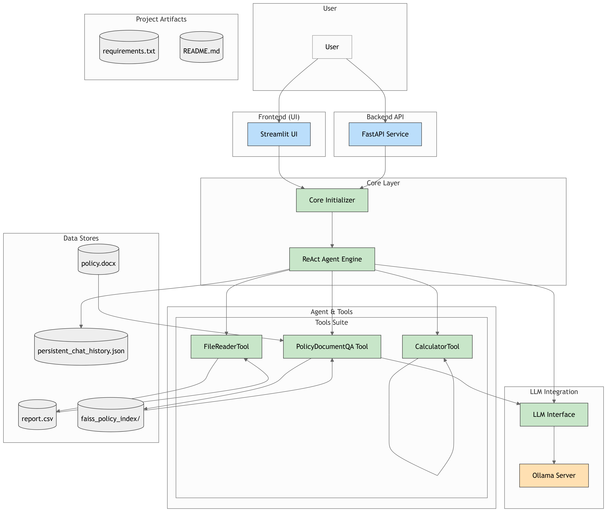

# Enhanced ReAct Agent with Local LLMs

## 1. Overview

This project implements an LLM-driven autonomous agent based on the ReAct (Reasoning and Acting) framework. The agent processes user instructions, dynamically plans and executes sub-tasks using available tools, and returns a final answer. It leverages locally hosted LLMs via Ollama, ensuring data privacy and customizability.

## Project Flow Diagram



**Key Features:**

*   **ReAct Framework:** The agent uses a "Thought-Action-Observation" loop to reason and interact with tools.
*   **Local LLMs (Ollama):**
    *   Uses `mistral` (or user-configured model) for ReAct agent reasoning and LangChain QA.
    *   Uses `nomic-embed-text` (or user-configured model) for document embeddings.
*   **Available Tools:**
    *   `PolicyDocumentQA`: Answers questions about a specific document (`policy.docx`) using a RAG pipeline (FAISS vector store and LangChain).
    *   `FileReaderTool`: Reads data from `report.csv` or text from `.txt` files.
    *   `CalculatorTool`: Evaluates mathematical expressions.
*   **Conversational Memory:** The agent considers recent conversation history. Chat history is persisted locally.
*   **Multi-Hop Reasoning:** Capable of breaking down complex queries into sequential tool uses.
*   **Transparent Reasoning:** The agent's thoughts, actions, and tool observations are displayed in a Streamlit UI.
*   **Self-Reflection & Error Handling:** The agent is prompted to learn from previous errors within a conversation.
*   **API & UI:**
    *   A Streamlit application (`app.py`) provides an interactive chat interface.
    *   A FastAPI application (`main_api.py`) is available for serving the agent via an API (optional).

## 2. Prerequisites

*   **Python:** Version 3.9 or higher.
*   **Ollama:** Must be installed and running. Visit [ollama.com](https://ollama.com/) for installation instructions for your operating system.
*   **Git:** (Optional, for cloning if this project is in a Git repository).

## 3. Ollama Setup

1.  **Install Ollama:** Follow the official instructions at [ollama.com](https://ollama.com/).
2.  **Pull Required Models:** Open your terminal and pull the default models used by this project:
    ```bash
    ollama pull mistral
    ollama pull nomic-embed-text
    ```
    *   `mistral` is used for the ReAct agent's reasoning and for the Q&A generation over documents.
    *   `nomic-embed-text` is used for generating embeddings for the document Q&A system.
    If you wish to use different models, you'll need to pull them and update the model names in `llm_interface.py` (for `REACT_LLM_MODEL_NAME`) and `tools.py` (for `EMBEDDING_MODEL_NAME` and `QA_LLM_MODEL`).
3.  **Ensure Ollama Server is Running:**
    *   On macOS and Windows, Ollama typically runs as a desktop application. Ensure it's launched.
    *   On Linux, Ollama might run as a systemd service. If not, you can start it manually in a terminal:
        ```bash
        ollama serve
        ```
    The agent needs to connect to the Ollama server (default: `http://localhost:11434`).
4.  **(Optional) Configure `OLLAMA_BASE_URL`:**
    If your Ollama server is running on a different host or port, set the `OLLAMA_BASE_URL` environment variable:
    ```bash
    export OLLAMA_BASE_URL="http://your-ollama-host:your-port" # Linux/macOS
    # set OLLAMA_BASE_URL=http://your-ollama-host:your-port   # Windows (Command Prompt)
    # $env:OLLAMA_BASE_URL="http://your-ollama-host:your-port" # Windows (PowerShell)
    ```
    The application will use this environment variable if set; otherwise, it defaults to `http://localhost:11434`.

## 4. Project Setup

1.  **Get Project Files:**
    *   If this project is a Git repository, clone it.
    *   Otherwise, create a new directory for the project (e.g., `react_agent_project`) and place all the provided Python files (`.py`), `policy.docx`, and `report.csv` into this directory.

    Your project directory should look like this:
    ```
    react_agent_project/
    ├── app.py
    ├── agent.py
    ├── tools.py
    ├── llm_interface.py
    ├── core_initializer.py
    ├── main_api.py
    ├── policy.docx         # Provided sample document
    ├── report.csv          # Provided sample CSV
    └── (more files later like requirements.txt, faiss_policy_index/)
    ```

2.  **(Recommended) Create and Activate a Python Virtual Environment:**
    Open your terminal in the project directory (`react_agent_project`):
    ```bash
    python -m venv venv
    ```
    Activate the virtual environment:
    *   On macOS/Linux:
        ```bash
        source venv/bin/activate
        ```
    *   On Windows:
        ```bash
        venv\Scripts\activate
        ```

3.  **Install Python Dependencies:**
    Install these dependencies using pip:
    ```bash
    pip install -r requirements.txt
    ```
    *Note: `faiss-cpu` is chosen for wider compatibility. If you have an NVIDIA GPU and CUDA installed, you might consider `faiss-gpu` for potentially faster performance, but this may require additional setup.*

4.  **Verify Data Files:**
    Ensure that `policy.docx` and `report.csv` are present in the root of your project directory. These are used by the `PolicyDocumentQA` and `FileReaderTool` respectively.

## 5. Running the Application

**Ensure Ollama is running and the required models are pulled before starting the application.**

1.  **Run the Streamlit Application:**
    Open your terminal in the project directory (with the virtual environment activated) and run:
    ```bash
    streamlit run app.py
    ```
    This will start the Streamlit web server. It should automatically open a new tab in your web browser (usually at `http://localhost:8501`).
    *   **First Run:** On the first run, the application will initialize the `PolicyDocumentQA` system. This involves reading `policy.docx`, splitting it into chunks, generating embeddings using Ollama, and building a FAISS vector index. This process can take a few minutes depending on your system and the document size. A directory named `faiss_policy_index/` will be created in your project folder to store this index for faster startups in subsequent runs. You'll see a spinner and log messages indicating this progress.
    *   **Subsequent Runs:** The application will load the existing FAISS index, making startup faster.

2.  **(Optional) Running the FastAPI Backend Separately:**
    The project includes `main_api.py` which can serve the agent via a REST API. If you wish to run this (e.g., for programmatic access without the Streamlit UI):
    ```bash
    python main_api.py
    ```
    This will start the FastAPI server, typically on `http://localhost:8000`. You can then interact with it using API clients like `curl` or Postman. The API provides a `/chat` endpoint and a `/health` endpoint. (Note: The Streamlit app `app.py` is self-contained and runs the agent logic directly; it does not *require* `main_api.py` to be running separately).

## 6. Project Structure

*   `app.py`: The main Streamlit application file for the user interface.
*   `agent.py`: Contains the core ReAct agent logic, including the prompt template and the iterative reasoning loop.
*   `tools.py`: Defines the tools available to the agent (`PolicyDocumentQA`, `FileReaderTool`, `CalculatorTool`) and includes the setup for the LangChain-based document Q&A system (FAISS, embeddings, QA chain).
*   `llm_interface.py`: Handles communication with the Ollama API for the ReAct agent's primary LLM calls.
*   `core_initializer.py`: A utility module to centralize the initialization of critical components like the QA system and the agent instance. This is called by `app.py` and `main_api.py`.
*   `main_api.py`: A FastAPI application that exposes the ReAct agent via an HTTP API (alternative to using the Streamlit UI).
*   `policy.docx`: An example employee leave policy document used by `PolicyDocumentQA`.
*   `report.csv`: An example CSV file with sales data, used by `FileReaderTool`.
*   `requirements.txt`: (You create this) Lists Python dependencies for the project.
*   `faiss_policy_index/`: (Created automatically on first run) Directory storing the FAISS vector index for `policy.docx`.
*   `persistent_chat_history.json`: (Created automatically) Stores the conversation history in JSON format.

## 7. Key Features & How They Work

*   **ReAct Agent (`agent.py`):**
    *   The `REACT_PROMPT_TEMPLATE` guides the LLM through the "Thought, Action, Observation" cycle.
    *   The agent analyzes the user query, decides on a tool, formulates tool input, and processes tool output.
    *   It includes instructions for self-reflection and error correction.
*   **Document Q&A (`tools.py` - `PolicyDocumentQA`):**
    *   Uses LangChain's `RetrievalQA` chain.
    *   `OllamaEmbeddings` (with `nomic-embed-text`) generates embeddings for text chunks from `policy.docx`.
    *   `FAISS` is used as a vector store for efficient similarity search.
    *   `LangChainOllama` (with `mistral`) generates answers based on retrieved document chunks.
    *   The FAISS index is persisted locally in `faiss_policy_index/` to avoid re-computation on every startup.
*   **File Reading (`tools.py` - `FileReaderTool`):**
    *   Reads `report.csv` using `pandas` and extracts column information, a data preview, and specific series like 'Revenue' values if present.
    *   Can read snippets from `.txt` files.
*   **Calculations (`tools.py` - `CalculatorTool`):**
    *   Evaluates simple mathematical expressions.
    *   Can sum numbers from a list string (e.g., `"[10, 20, 30]"`).
*   **Conversational Memory:**
    *   The Streamlit UI (`app.py`) displays the full chat history and saves it to `persistent_chat_history.json`.
    *   For each new query, `app.py` formats recent turns of the conversation and passes them to the `agent.run()` method.
    *   The agent's prompt (`REACT_PROMPT_TEMPLATE` in `agent.py`) includes a placeholder for `conversation_history`.
*   **Self-Reflection & Error Handling:**
    *   The ReAct prompt template explicitly instructs the LLM to analyze previous errors (from `Recent Errors` list) and adjust its plan.
    *   The agent maintains a short-term `error_memory` to avoid repeating the exact same mistakes.
    *   Tool execution errors are reported back as observations for the LLM to process.
*   **Centralized Initialization (`core_initializer.py`):**
    *   `initialize_all_systems()` function ensures that the document QA system (including FAISS index) and the `ReActAgent` instance are ready before the application handles user queries. This is called on startup by `app.py` and `main_api.py`.

## 8. Troubleshooting

*   **Ollama Connection Errors ("Connection refused", "Timeout"):**
    *   Ensure the Ollama application/server is running.
    *   Verify that the `OLLAMA_BASE_URL` (if set) points to the correct address and port, or that Ollama is running on the default `http://localhost:11434`.
    *   Check firewall settings if Ollama is running on a different machine or in a container.
*   **Model Not Found Errors (e.g., "model 'mistral' not found"):**
    *   Make sure you have pulled the required models using `ollama pull mistral` and `ollama pull nomic-embed-text`.
    *   Verify the model names in `llm_interface.py` (REACT_LLM_MODEL_NAME) and `tools.py` (EMBEDDING_MODEL_NAME, QA_LLM_MODEL) match the models you have pulled.
*   **FAISS Index Errors or Slow First Run:**
    *   The first run will be slower as it builds the FAISS index for `policy.docx`. This is normal.
    *   Ensure your project directory has write permissions so that `faiss_policy_index/` can be created.
    *   If you encounter errors related to `faiss-cpu` during installation or runtime (e.g., "DLL load failed," "symbol not found"), you might need to:
        *   Ensure you have a C++ compiler installed (build tools for your OS).
        *   Check for specific OS requirements or pre-compiled binaries for `faiss-cpu`.
        *   Try reinstalling: `pip uninstall faiss-cpu` then `pip install faiss-cpu --no-cache-dir`.
*   **File Not Found (`policy.docx`, `report.csv`):**
    *   Ensure these files are located in the root of your project directory (the same directory where you run `streamlit run app.py`).
    *   The application expects `policy.docx` (path configured in `tools.DOC_PATH`) and `report.csv` (hardcoded in `FileReaderTool` logic and `app.py` file check).
*   **Streamlit / FastAPI Command Not Found:**
    *   Make sure your Python virtual environment is activated.
    *   Verify that `streamlit` and `fastapi`/`uvicorn` were installed correctly via `pip install -r requirements.txt`.
*   **Permission Errors (e.g., for `persistent_chat_history.json`, `faiss_policy_index/`):**
    *   Ensure the user running the application has write permissions for the project directory.
*   **ModuleNotFoundError:**
    *   Ensure all custom Python files (`agent.py`, `tools.py`, etc.) are in the same directory and your virtual environment is active.
*   **Agent Stuck or Not Behaving as Expected:**
    *   The agent's performance heavily depends on the LLM (`mistral` by default). Complex queries or ambiguous situations can sometimes lead to loops or incorrect tool usage.
    *   Review the reasoning trace in the Streamlit UI for clues.
    *   Consider adjusting the `REACT_PROMPT_TEMPLATE` in `agent.py` or trying a different Ollama model.
    *   The `MAX_ITERATIONS` constant in `agent.py` prevents infinite loops but may terminate long-running valid tasks prematurely if set too low.